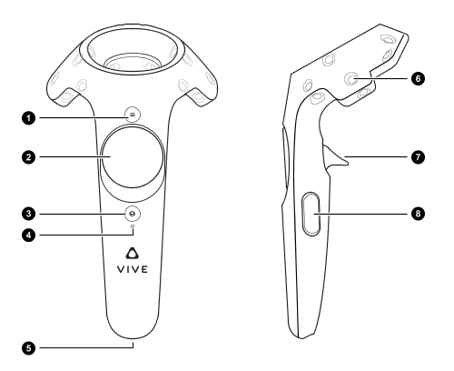
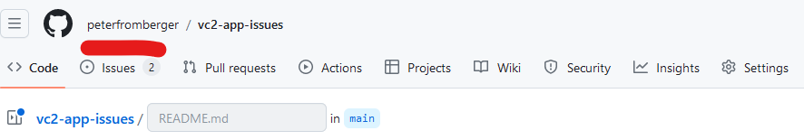
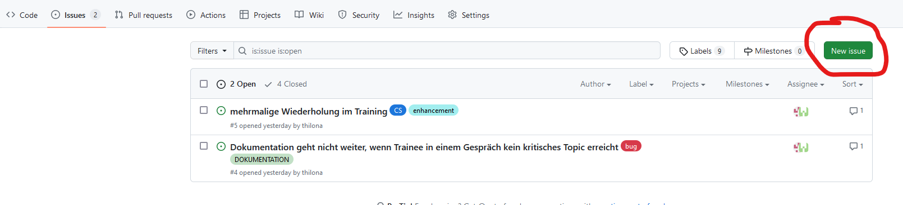

# ViContact App

## Systemvoraussetzungen
- Windows 11
- VR-fähige Grafikkarte
- SteamVR-kompatibles VR-Headset

## Allgemeine Hinweise zur Installation und Nutzung der ViContact App
- Die ViContact App installiert selbstständig alle notwendigen Softwareelemente, jedoch NICHT die notwendigen Treiber für das VR-Headset (dadurch ist es möglich, die App mit unterschiedlichen VR-Headsets zu nutzen)
- Die ViContact App unterstützt ausschließlich VR-Headsets, die mit SteamVR kompatibel sind (u. a. HTC Vive Pro 2).
- Bitte folgen Sie daher zunächst den Anweisungen im Benutzerhandbuch ihres VR-Headsets zur Installation und Einrichtung der Hardware
- <b>Steam</b> und <b>SteamVR</b> muss auf ihrem Rechner installiert sein, bevor sie ein Training durchführen können. Bitte folgen Sie dazu den entsprechenden Hinweisen in den Anweisungen zu ihrer VR-Hardware und/oder hier:<a href="https://www.steamvr.com/de/" target="_blank"> Steam und/oder SteamVR installieren</a>
- ViContact setzt voraus, dass das VR-Headset im <b>Stand- oder Sitzmodus kalibriert</b> wurde. Folgen Sie dazu bitte der Anleitung des Herstellers ihres VR-Headsets.
- ViContact erfordert mindestens zwei Bildschirme (zusätzlich zum VR-Headset). Es öffnet sich nach der Initialisierung ein Fenster der VR-Umgebung im Vollbildmodus. Bitte ordnen sie die unterschiedlichen Bildschirme so an, dass sie sowohl die ViContact-Oberfläche als auch die VR-Oberfläche sehen können. <b>Wenn sie die VR-Umgebung per Hand schließen, funktioniert das Programm nicht mehr.</b>
- <b>Bitte stellen sie sicher, dass ihr VR-Headset angeschlossen, eingeschaltet und SteamVR bereits geöffnet ist, bevor sie ein Training starten. SteamVR muss sowohl ihr VR-Headset als auch den Controller bereits erkannt haben, bevor sie auf <i>WEITER</i> klicken.</b>

## Wichtiger Hinweis zur Nutzung der App
Es wird ein VR-Controller benötigt. Mit welcher Hand dieser benutzt wird ist unerheblich. <b>Um mit einem vKind zu sprechen, müssen Sie die sog. Trigger-Taste gedrückt halten solange sie sprechen.</b> Beim Controller für die HTC Vive Pro ist das die Taste mit der Nummer 7 im folgenden Bild:

## Allgemeine Hinweise zum Erstellen von Fehlermeldungen
Hier können Fehler im Zusammenhang mit der ViContact App gemeldet werden. Klicken Sie dazu zunächst auf das Issues-Tap:

Und erstellen sie dann einen neuen Issue:

- Bitte nutzen Sie die entsprechenden Templates. Es wird grundlegend unterschieden zwischen Fehlern (im Programm funktioniert etwas nicht so wie es sollte/abgesprochen war) oder wünschenswerte Verbesserungen (die allerdings nicht notwendig sind um die App und ihre Funktionen zu nutzen).
- Bitte geben Sie ALLE im template geforderten Angaben an, sonst kann der Fehler nicht bearbeitet werden
- Bitte fügen sie sich selbst als assignee hinzu, nur so kann ich erkennen, von wem der Fehler kommt
- Oftmals sind Nachfragen zu einem fehler notwendig. Wenn Sie als Assignee gekennzeichnet sind, erhalten sie alle Fragen und Antworten automatisch per Email

